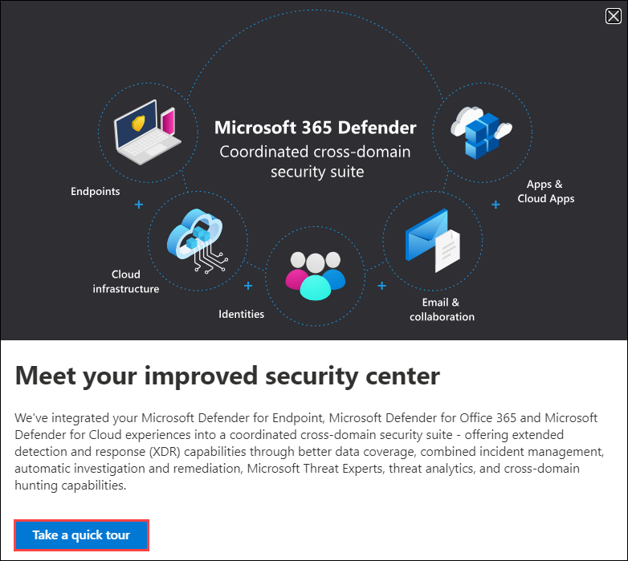
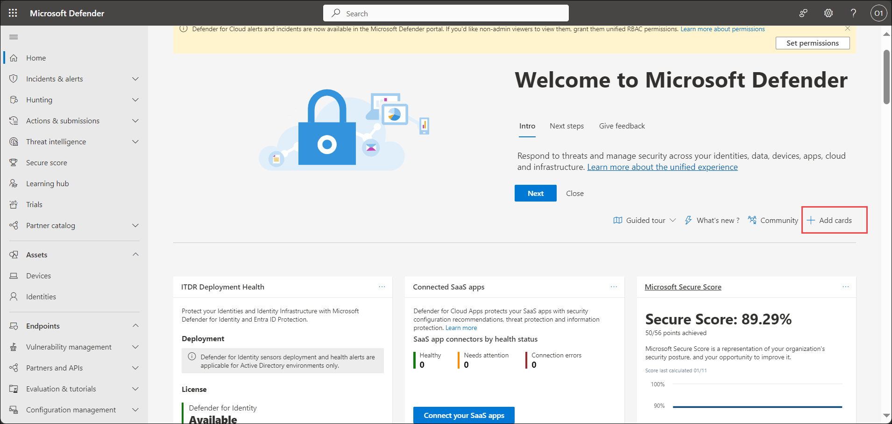
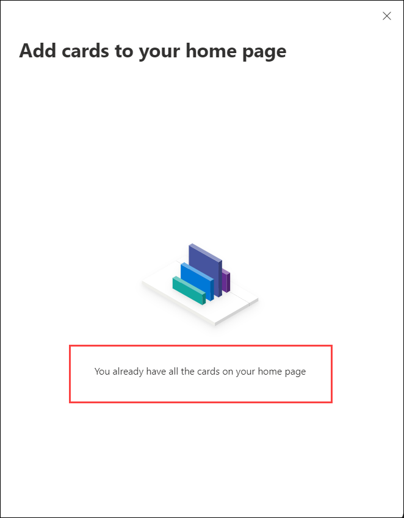
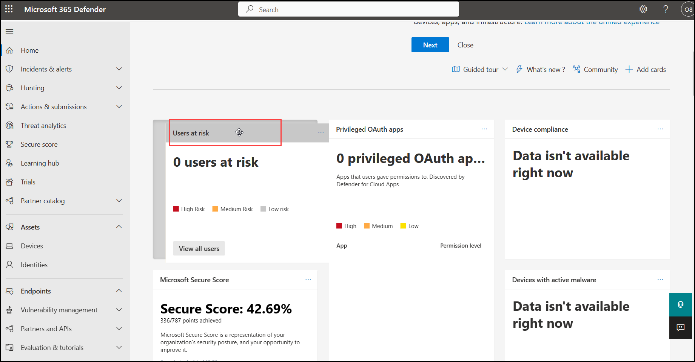

## Lab 01 - Explore Microsoft Defender Portal

## Lab scenario

The Microsoft Defender portal at https://security.microsoft.com combines protection, detection, investigation, and response to email, collaboration, identity, device, and cloud app threats, in a central place. The Defender portal emphasizes quick access to information, simpler layouts, and bringing related information together for easier use.

## Lab objectives (Duration: 20 minutes)

In this lab, you will complete the following tasks:
- Exercise 1: Learn about Microsoft Defender Portal
- Exercise 2: Discover the features of the Microsoft Defender Portal

### Exercise 1: Learn about Microsoft Defender Portal [Read Only]

The Microsoft Defender portal combines protection, detection, investigation, and response to email, collaboration, identity, device, and cloud app threats, in a central place. The Defender portal emphasizes quick access to information, simpler layouts, and bringing related information together for easier use. It includes:

- **Microsoft Defender for Office 365:** Microsoft Defender for Office 365 helps organizations secure their enterprise with a set of prevention, detection, investigation and hunting features to protect email, and Office 365 resources.  
You can access the link to gain a fundamental understanding of Microsoft Defender for Office 365 [Microsoft Defender for Office 365](https://learn.microsoft.com/en-us/microsoft-365/security/office-365-security/mdo-about?view=o365-worldwide)
  
- **Microsoft Defender for Identity:** is a cloud-based security solution that uses your on-premises Active Directory signals to identify, detect, and investigate advanced threats, compromised identities, and malicious insider actions directed at your organization.  
You can access the link to gain a fundamental understanding of Microsoft Defender for Identity[Microsoft Defender for Identity](https://learn.microsoft.com/en-us/defender-for-identity/what-is)

- **Microsoft Defender for Cloud Apps:** is a comprehensive cross-SaaS and PaaS solution bringing deep visibility, strong data controls, and enhanced threat protection to your cloud apps.  
You can access the link to gain a fundamental understanding of Microsoft Defender for Cloud Apps [Microsoft Defender for Cloud Apps](https://learn.microsoft.com/en-us/defender-cloud-apps/what-is-defender-for-cloud-apps)

- **Microsoft Defender for Endpoint:** delivers preventative protection, post-breach detection, automated investigation, and response for devices in your organization. 
You can access the link to gain a fundamental understanding of Microsoft Defender for Endpoint [Microsoft Defender for Endpoint](https://learn.microsoft.com/en-us/microsoft-365/security/defender-endpoint/microsoft-defender-endpoint?view=o365-worldwide#compare-microsoft-endpoint-security-plans-1)

### Exercise 2: Discover the features of the Microsoft Defender Portal

1. Start the Microsoft Edge browser. If a pop up appears in the browser to copy the data from clipboard, click on Allow.

1. Access the Microsoft Defender portal in the Edge browser by going to [Microsoft Defender Portal](https://security.microsoft.com).

1. In the **Sign in** dialog box, copy and paste Email/Username: <inject key="AzureAdUserEmail"></inject> and then select Next.

1. In the **Enter password** dialog box, copy and paste Password: <inject key="AzureAdUserPassword"></inject> and then select **Sign in**.

  >**Note:** If a dialog box appears stating action required to set up MFA, click on **Ask later**.

1. If prompted to stay signed in, you can click **Yes**.

1. If this is the first time you visit the Microsoft 365 Defender portal, you may get a pop-up window to take a quick tour. It is recommended that you complete the tour. Select **Take a quick tour**. Read the description provided in each pop-up window, then select Next. Continue through the tour until you get to the end, then select **Done**. 

   

1. On the **Microsoft Defender** portal, a dialog box will appear you can click on next and explore the portal.
   
   

   >**Note:** If the dialog box is will not appear you can navigate to the **Guided Tour** and Click on **Cloud apps**.

      

1. The welcome page of the Microsoft 365 Defender portal, shows many of the common cards that security teams need. The composition of cards and data is dependent on the user role. Scroll through the page to view the default set of cards for your role as global admin.

1. The cards displayed can be customized to your preference. Select **+ Add cards**. A Window opens indicating that you already have all the cards on your home page. Close the window by select the X on top-right corner of the window.

   

   

1. Selecting the ellipses on the top-right of any card will provide the option to Remove.

1. You can also move the cards around. Hover your mouse cursor over the title bar of any card, when you will get a cross shaped cursor select the card and move it to your desired location.

   

1. Examine the video to thoroughly explore the Microsoft Defender Portal [Microsoft Defender Portal](https://www.microsoft.com/en-us/videoplayer/embed/RWBKau?postJsllMsg=true)

## Review
In this lab, you will complete the following tasks:
- Learned about Microsoft Defender Portal
- Discover the features of the Microsoft Defender Portal
