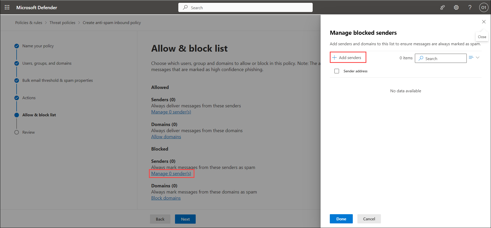
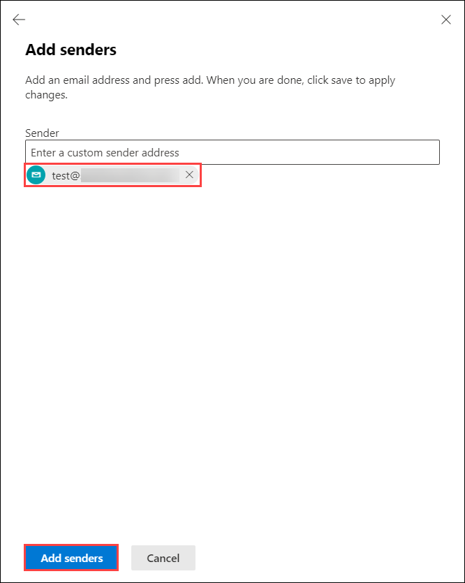
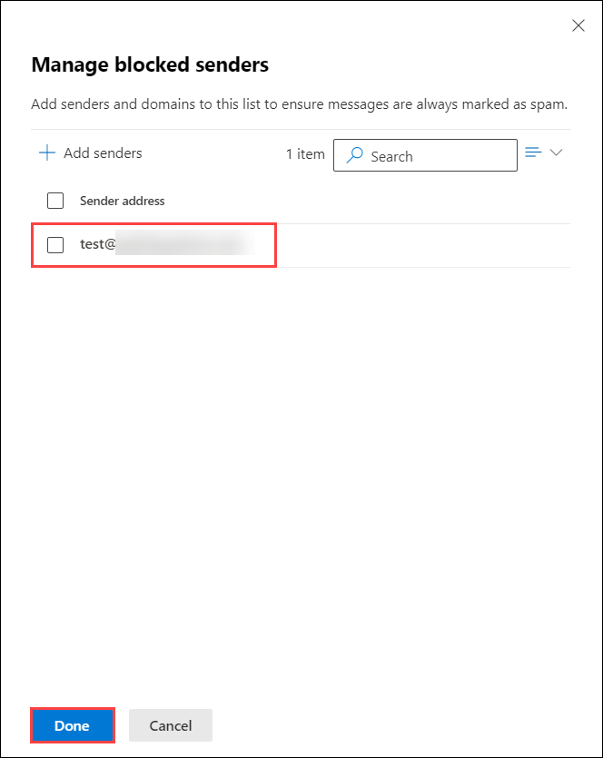
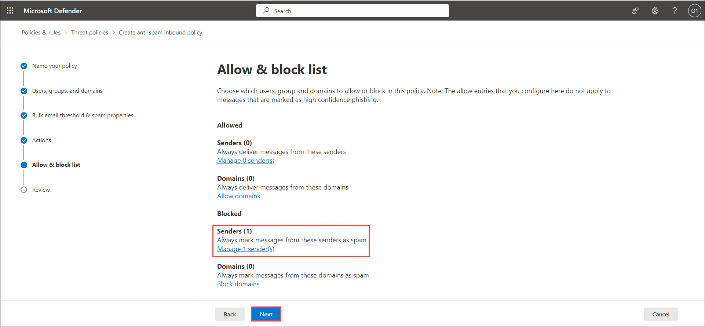
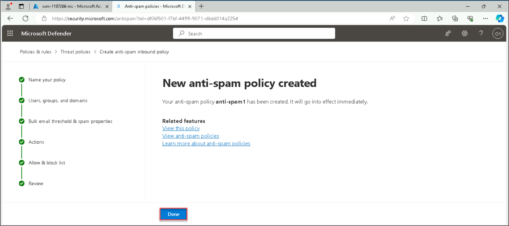
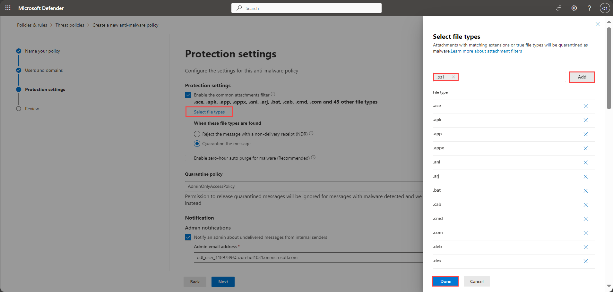
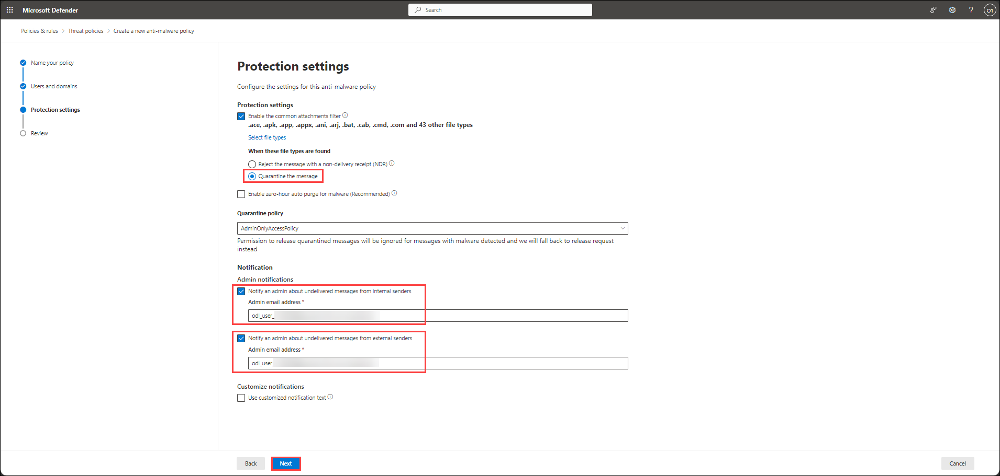
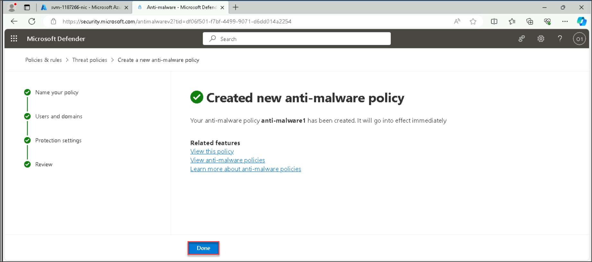
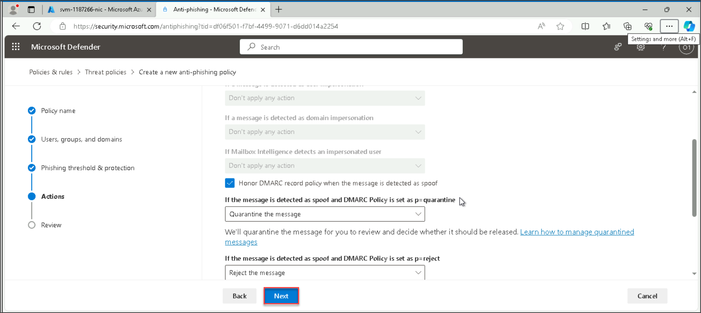
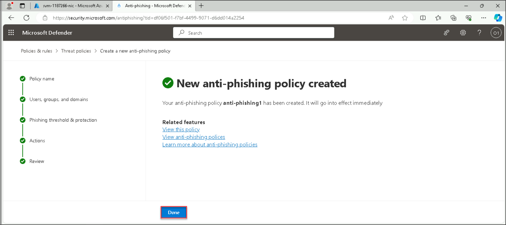

## Lab 03 - Configure Protection Policies

## Lab scenario

In this lab, you will Configure Anti-Spam, Anti-Malware, and Anti-Phishing policies in Microsoft Defender for Office 365 involves setting up rules to detect unwanted emails (spam), safeguard against malicious software (malware), and identify and block phishing attempts.

## Lab objectives (Duration: 50 minutes)

In this lab, you will complete the following tasks:
- Exercise 1: Configure Anti-Spam Policy
- Exercise 2: Configure Anti-malware Policy
- Exercise 3: Configure Anti-phishing Policy

## Architecture Diagram

   

### Exercise 1: Configure Anti-Spam Policy

Anti-spam policies serve as the backbone for managing configurable settings related to spam filtering. These policies play a crucial role in filtering both incoming and outgoing emails, employing a diverse range of techniques such as content analysis and sender reputation checks to identify and prevent the transmission of spam. Anti-Spam policies are essential components in safeguarding your email communication against unwanted and potentially harmful spam. By configuring these policies, you gain control over the parameters that dictate how spam is identified and handled within your email environment.

1. Go to Microsoft Defender Portal at https://security.microsoft.com/.
2. Go to **Email and Collaboration** > **Policies & rules**> Select the **Threat policies**.
   
   

3. Under Policies Select the **Anti-spam**.

   
   
4. Select **Create Policy** > **Inbound**.

   

5. Under Name your policy tab provide **Name** : anti-spam and Description: anti-spam and select Next.

   

6. Under **Users, groups and domains** tab you will add the Users, Groups and Domains to be included in the Anti spam policy as depicted in the screenshot and select Next.

   

>**Note**: As we haven't created any groups so we will be configuring only Users and the domain for now. In the environment details tab you will get the username, the first part of the username will be the user & the second part will be the domain. Example, if the username is odl_user_1187266@azurehol1017.onmicrosoft.com, then the user would be **ODL_User 1187266**, while domain name would be **azurehol1017.onmicrosoft.com**.

7. Under Bulk email threshold & spam properties tab. Keep the default option selected and select Next. (The properties are customizable and can be adjusted to suit specific requirements)

   

8. Under Actions tab. Keep the default option selected and select Next.

   

9. Under Allow & block list tab. Select the **Manage 0 sender(s)** under **Senders(0)** in Blocked section to block the emails from sending emails. Manage blocked senders tab will open, select **+ Add senders**

   

10. A new tab **Add senders** will open. Provide your personal email address to verify whether the block is functioning correctly or not and select **Add senders**. Select **Done**.

    

    

11. You can see one sender is selected in the Blocked Senders section. Select **Next**.

    

10. Under Review tab. Select **Create** button.

    

11. Click on Done.

    

12. Feel free to use the personal email address you provided in step 10 to send an email to the ODL_user email id: <inject key="AzureAdUserEmail"></inject> . You'll observe that the email is being filtered into the Junk Email folder.

### Exercise 2: Configure Anti-malware Policy

Anti-Malware policies are designed to safeguard against malware, viruses, spyware, and other harmful software that could be transmitted through emails. Anti-Malware policies scan incoming and outgoing emails for malicious content like malware and viruses. They use signature-based and behavior-based detection to identify threats, taking predefined actions upon detection, such as quarantining or deleting malicious attachments or links.

1. Go to Microsoft Defender Portal at https://security.microsoft.com/.
2. Go to **Email and Collaboration** > **Policies & rules**> Select the **Threat policies**.
   
   

3. Under Policies Select the **Anti-malware**.

   

4. Select **Create** in Anti-malware tab.

   

5. Under Name your policy tab provide **Name** : anti-malware and Description: Malware Policy and select Next.

   

6. Under **Users and domains** tab add the Users, Groups and Domains to be included in the Anti malware policy and select Next.

   

>**Note**: As we haven't created any groups so we will be configuring only Users and the domain for now.In the environment details tab you will get the username, the first part of the username will be the user & the second part will be the domain. Example, if the username is odl_user_1187266@azurehol1017.onmicrosoft.com, then the user would be **ODL_User 1187266**, while domain name would be **azurehol1017.onmicrosoft.com**.

7. Under Protected settings tab, select **Select file types** to choose the file types which are automatically identified as malware in email messages. Type **.ps1** and select it. Select **Add** and **Done** button to add .ps1 file types as malware in the emails.

   

8. In the Protected settings tab, select **Quarantine the message** under when these file types are found and select **Notify an admin about undelivered messages from internal senders** and **Notify an admin about undelivered messages from internal senders** and provide the ODL_user email id: <inject key="AzureAdUserEmail"></inject> in both section and select **Next**.

   

8. Under Review tab. Click on Submit button.

   

9. Click on Done.
    
    

12. Feel free to use your personal email address to send an email to the ODL_user email id: <inject key="AzureAdUserEmail"></inject> with any of the file types mentioned in the protection settings but for now you can add any file with type **.ps1** extension and send the email. You'll receive one email observe that the email is being filtered into the Junk Email folder.

### Exercise 3: Configure Anti-phishing Policy

Anti-phishing in Microsoft Defender for Office 365 is a comprehensive security feature designed to protect against phishing attacks within emails. Anti-phishing feature works by continuously scanning incoming emails in real-time, employing techniques like suspicious URLs and content analysis to detect potential phishing threats.

1. Go to Microsoft Defender Portal at https://security.microsoft.com/.
2. Go to **Email and Collaboration** > **Policies & rules**> Select the **Threat policies**.
   
   

3. Under Policies Select the **Anti-phishing**.

4. Under policy name tab provide **Name** : anti-phishing and Description: anti phishing and select Next.

   

5. Under **Users, groups and domains** tab add the Users, Groups and Domains to be included in the Anti phishing policy and select Next.

   

>**Note**: As we haven't created any groups so we will be configuring only Users and the domain for now.In the environment details tab you will get the username, the first part of the username will be the user & the second part will be the domain. Example, if the username is odl_user_1187266@azurehol1017.onmicrosoft.com, then the user would be **ODL_User 1187266**, while domain name would be **azurehol1017.onmicrosoft.com**.

6. Under Phishing threshold & protection tab add the senders and custom domains as required and select Next.

   

7. Under Actions tab, keep the default options selected and click on Next.

   

8. Under Review tab, click on Submit button.

   

9. Click on Done.

   

## Review
In this lab, you will complete the following tasks:
- Configured Anti-Spam Policy
- Configured Anti-malware Policy
- Configured Anti-phishing Policy
