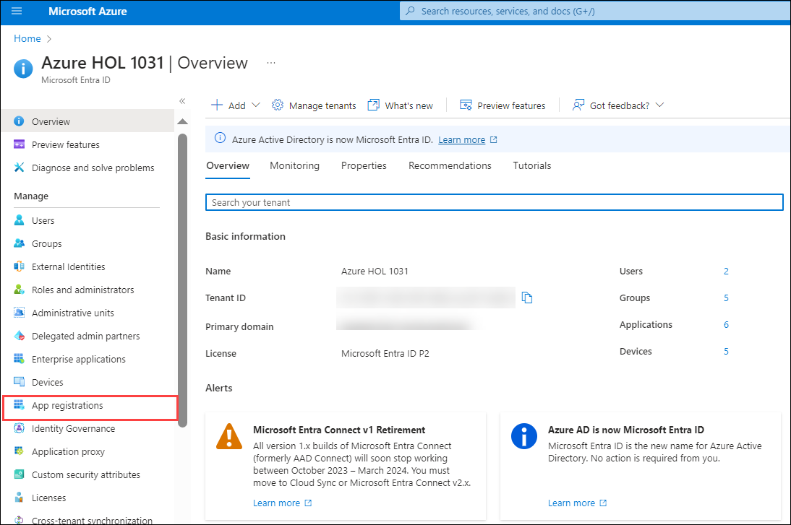
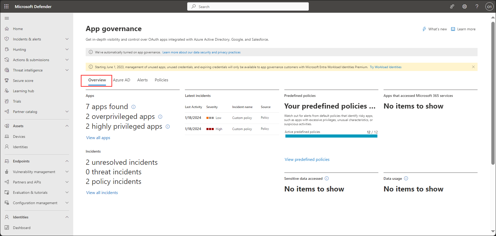
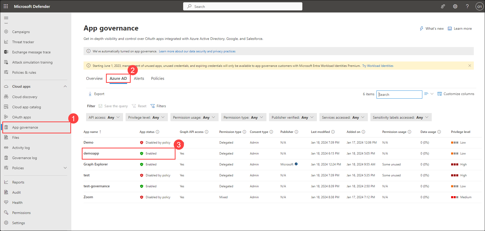
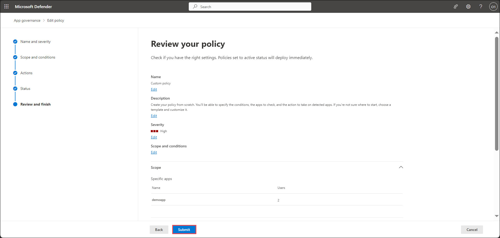
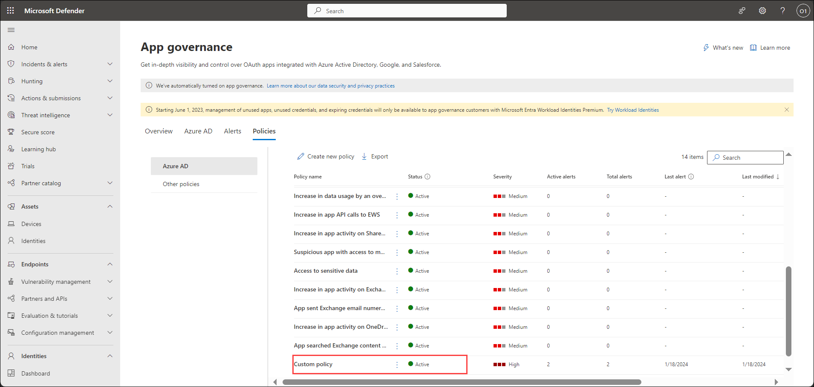

## Lab 11 - Setup Alerts & App Governance 

## Lab scenario

In this lab, we will configure alert notifications in Microsoft Defender to manage potential threats, setting up email alerts for different severity levels. Simultaneously, we will establish App Governance within Microsoft 365 Security, activating governance frameworks, registering an application in Microsoft Entra ID using app registration and creating OAuth app policies to regulate data usage for specific Azure AD apps. This lab equips admins to proactively monitor and respond to alerts while enforcing robust governance for secure and compliant app utilization.

## Lab objectives (Duration: 60 minutes)

In this lab, you will complete the following tasks:
- Exercise 1: Configure alert notifications in Microsoft Defender for Cloud Apps 
- Exercise 2: Setup App Governance  

## Architecture Diagram

   

### Exercise 1: Configure alert notifications in Microsoft Defender for Cloud Apps

Setting up alerts in Microsoft Defender for Cloud Apps involves configuring policies to detect and notify about specific activities or security incidents within your cloud environment. These policies, tailored to your organization's needs, enable you to define conditions triggering alerts, specify alert severity levels, and choose notification channels.

1. In the Microsoft Defender Portal, select **Settings**. Then choose **Cloud Apps**.

   

2. Under My account, select **My email notifications**.

   

3. In the My email notifications page, select the checkbox for **Receive email notifications for defender for Cloud Apps alerts whose severity is at least** and under **Choose Severity** click on the dropdown button and select **Medium**. Click on **Save**.

   

### Exercise 2: Setup App Governance  

App Governance in Microsoft Defender for Cloud Apps empowers organizations to manage and regulate the usage of applications within their cloud environment. This functionality enables administrators to establish policies, controls, and compliance measures to oversee app activities. With App Governance, admins can enforce specific access policies, monitor app behavior for compliance violations, and implement measures to mitigate risks associated with app usage. This capability provides granular control and helps ensure that cloud applications align with security standards and organizational policies.

#### Task 1: Turn on app governance

1. Navigate to https://security.microsoft.com/ and login with global admin credentials. Go to **Settings > Cloud Apps > App governance**.

   

2. Select **Service status** under App governance. Select **Turn on app governance**.

   

3. Click on **Go to App governance**.

    
   
   >**Note**: Once App governance is on. Sign in again to start using it.   
   >**Note**: **You'll need to wait up to 10 hours to see and use the product.**

3. After getting, the app governance provisioned You will see the app governance page. In the Privacy consent required tab. Select **Accept**.

   

#### Task 2: Register an application in Microsoft Entra ID

1. In the **Search resources, services, and docs** text box at the top of the Azure portal page, type **Microsoft Entra ID** and press the **Enter** key.

2. On the **Overview** blade of the Microsoft Entra ID tenant, in the **Manage** section, select **App registrations**.

   

3. On the **App registrations** page, on the menu, select **+ New registration**.

   

4. On the **Register an application** blade, register an app named **demoapp** using the default values. Under **Supported account types**, select **Accounts in this organizational directory only (xxxx only - Single tenant)**, and rest you do not need to enter the redirect URI, select **Register**.

   

5. You will be redirected to demoapp app registration, in the **Manage** section, select **API permissions**. Under Configured permissions, select **+ Add a permission**. A new tab **Request API permissions** will open, under **Select an API** select **APIs my organization uses**. Type **Microsoft Cloud App Security** and select it.

   

6. Under **Microsoft Cloud App Security** option, select **Delegated permissions**>**investigation.read** and then select **Add permissions** button.
Select **Add admin consent for xxxx**

   

7. A new tab **Grant admin consent confirmation** will open. Select **Yes**.

   

   >**Note**: **You'll need to wait up to 24 hours to see and use the app created in app registration in next task.**

#### Task 3: Create OAuth app policies for Microsoft Entra ID

1. Go to **Microsoft Defender XDR portal > App governance**, select **Overview** tab. You will be able to view number of applications set up in App Governance, as well as the number of incidents generated within the app governance.

   

2. Go to **Microsoft Defender XDR portal > App governance**, select **Azure AD** tab. You will observe all the applications within app governance. The **demoapp**, which was created in Task 2, is visible. Currently, you can observe that it is in an **Enabled** state.

   

3. To create a new app policy for Azure AD apps, go to **Microsoft Defender XDR > App governance > Policies > Azure AD > Create new policy**.

   

4. To create a custom policy, select the **Custom** category. Under Template select **Custom Policy**. Select **Next**.

   

5. Provide the details and Click **Next**.
- Policy name: **Custom Policy**
- Description: **Custom Policy**
- Severity: **High**

   

6. Under Set policy scope and conditions tab select **No, I'll customize the policy**.

   

7. In Set policy scope and conditions tab, under Policy scope Select **Specific apps > demoapp > Add** and then select **Next**.

   

   >**Note**: **You'll need to wait up to 24 hours to see and use the app created in app registrations to become visible here. You can return in 2-3 hours to verify whether the app is visible at this location.**

8. In Apply default conditions from the template? Select **No, I'll edit the conditions** and Select **Edit conditions**.

   

9. Under Edit policy conditions. Select **Add condition** and select **Non-Graph API permissions**. Under Non-Graph API permissions, keep Apps with permissions to non-Graph APIs to **Yes**. Select **Save** and then select **Next**.

   

   

10. Under Set policy action select the check-box next to **Disable app** and select **Next**.

   

11. Under Set policy status select **Active** and select **Next**.

   

12. Under review your policy select **Submit** and select **Done**.

    

13. Upon redirection to the App governance page, navigate to **Policies > Azure AD** and scroll down. You will observe the existence of the Custom Policy, which is currently in an **Active** status.

    

14. Go to **Microsoft Defender XDR portal > App governance**, select **Azure AD** tab. The **demoapp**, which was created in Task 2, its status will be changed into **Disabled by policy** state.

   >**Note**: **You'll need to wait up to 24 hours to observe the outcome of the applied policy in app governance, resulting in a change in the status of the demoapp.**

## Review
In this lab, you will complete the following tasks:
- Configured alert notifications in Microsoft Defender for Cloud Apps 
- Setup App Governance
